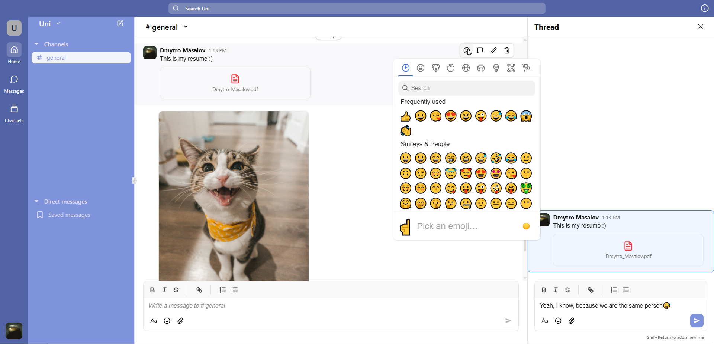

# 💬 Team Chat App

This is a pet-project I built to explore and apply modern web technologies. It’s a lightweight chat app with a philosophy similar to **Slack** and **Discord**, featuring real-time communication, user authentication, role based access, and a clean UI.

The project was inspired by an excellent video tutorial by **Code with Antonio**:  
[Watch the tutorial on YouTube](https://www.youtube.com/watch?v=lXITA5MZIiI&t=4493s)

The main page of the app looks like this:



## ⚙️ Tech Stack

- **Next.js** – routing, and frontend logic
- **Convex** – data operations, authentication
- **shadcn/ui** – UI components
- **Zustand** – state management
- **Nuqs** – sync state with URL query params
- **Quill.js** – rich text editor for messages

## 🚀 Deployment

This project is intended to be **deployed and run locally**. Follow the steps below to get everything set up:

---

### ✅ Step-by-step Instructions

1. Open your terminal and navigate to the folder where you want to clone the project.

2. Clone the repository from GitHub:
   ```bash
   git clone https://github.com/masalovd/team-chat-app
   ```

3. Navigate into the project directory:
    ```bash
    git clone https://github.com/masalovd/team-chat-app
    ```

4. Install dependencies:
    ```bash
    npm install
    ```
5. Run Convex backend and dashboard locally with Docker:
    ```bash
    docker compose up
    ```

6. Generate an admin key for the dashboard/CLI:
    ```bash
    docker compose exec backend ./generate_admin_key.sh
    ```

   You’ll get a key like:
  
    ```bash
    convex-self-hosted|<your-generated-key>
    ```

7. Fill env.local with the following values (use `env.local.example`):
    ```bash
    CONVEX_URL=http://localhost:3210
    CONVEX_ADMIN_KEY=convex-self-hosted|your-generated-key
    NEXT_PUBLIC_CONVEX_URL=http://localhost:3210
    ```

8. Start the Convex app locally:
    ```bash
    npx convex dev
    ```

9. Set up password authentication using JWT:
  
    Generate private and public keys:
      
    ```bash
    node generateKeys.mjs
    ```
    You will get two values:
    ```bash
    JWT_PRIVATE_KEY="<your-private-key>"
    JWKS="<your-jwks>"
    ```

10. Set the environment variables in Convex:

    ```bash
    npx convex env set JWT_PRIVATE_KEY <your-private-key>
    npx convex env set JWKS <your-jwks>
    ```

11. Configure Google OAuth authentication

    Follow this guide: [Google OAuth Setup →](https://labs.convex.dev/auth/config/oauth/google)

12. Start the production build of the Next.js app and Convex backend in separate terminal windows:
    ```bash
    # Terminal 1
    npx convex dev

    # Terminal 2
    npm run prod
    ```
13. Open the app in your browser: [http://localhost:3000](http://localhost:3000)
